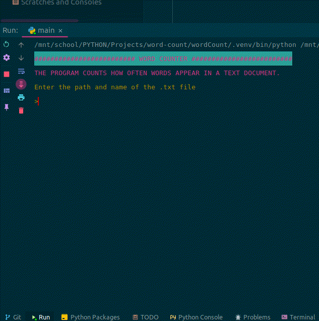

# Word count

A simple program that counts how often words appear in a text document.  
The result is a sorted table in the terminal.

Made for fun with tea and cookies

P.S.  
If the table output does not fit in the terminal, increase "limit scrollback"